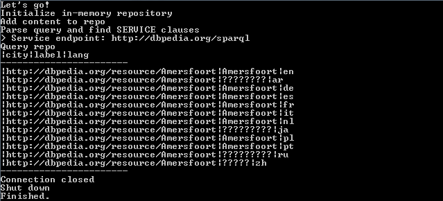

# rdf4jtest
A quick test for rdf4j

The test does the following:

- Create an in-memory triplestore (RDF4j repository);
- Adds some triples to the triplestore (from a file);
- Defines a query to be executed;
- Parses the query for federated SERVICE clauses;
- Executes the query (federated, accessing dbpedia)

Result:

